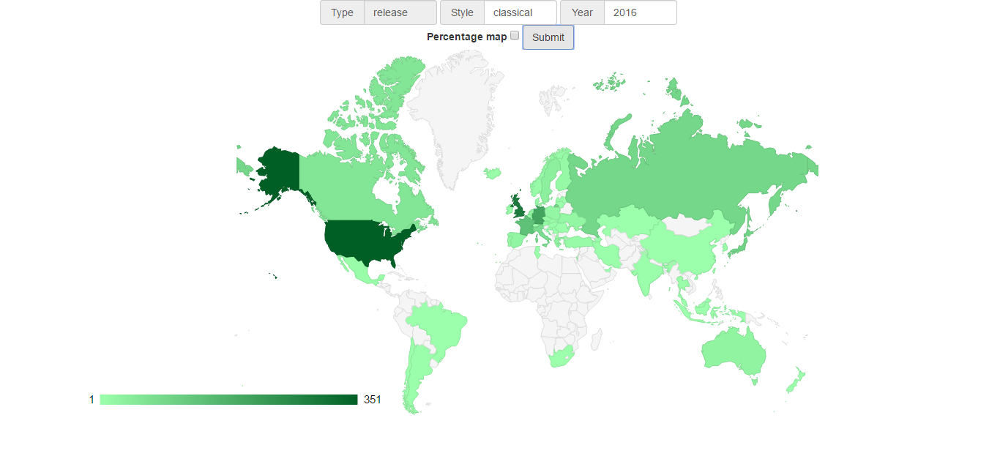

# Discogs releases research
> Інтерактивна мапа на основі Discogs API



У даній програмі користувач може задавати рік та стиль релізу. І на основі введених даних буде виведено карту світу, де у відповідність кожній країні буде надано певний відтінок кольору і при наведенні на неї буде відображена детальніша інформація. За допомогою цієї програми можна легко прослідкувати популярність різних стилів в різних роках по усьому світу (у Discogs API міститься інформація тільки з 1990 року!)

Ця програма являє собою невеликий сайт, де користувач вводить рік та стиль релізу і як результат отримає карту з країнами, яку можна детальніше вивчити окремо для кожної країни.

Для виконання даного проекту було використано Discogs API, звідки береться вся інформація. Будування запиту та обчислення отриманої інформації відбувається на Python. А для серверної частини було використано Flask.

## Вхідні та вихідні дані
Вхідними даними є лише рік та стиль релізів, які користувач хоче відобразити на карті. Ці дані використовуються для запиту до Discogs API, після чого посторінково отримується інформація, а саме 50 релізів на сторінку. Отримана інформація зберігається в MixedPaginatedList, де спершу міститься лише 1 сторінка, а інша інформація отримується поступово в залежності від бажаної кількості інформації

Кожен елемент даного MixedPaginatedList є об’єкт класу Release, який містить лише id релізу та посилання на детальнішу інформацію. Також можна відправити запит для отримання числа, яке відповідає усій кількості знайденої інформації по даному запиту.

Тому для побудови карти світу необхідно відправити запит для кожної країни. Це є 126 запитів, бо деякі країни світу не є у списку Disgos API, або записані з кількістю релізів, що дорівнює нулю. Тож, для кожної країни отримуються 2 інформації: кількість релізів по стилю та загальна кількість. Це необхідно для проведення відсоткових обчислень та просто відображення кількості окремо по стилю та загалом.

Вихідними даними програми є список списків з необхідною для користувача інформацією, а саме відсотковими або кількісними відповідностями для кожної країни. Після цього уся інформація візуалізується у вигляді карти з детальним відображенням інформації для кожної країни. Після цього користувач має можливість здійснювати ще запити за іншими стилями та роками і отримувати інформацію у тому ж форматі.

## Структура
Структура проекту:
- doc/ - модулі з детальними описами усіх етапів виконання проекту
- examples/ - містить приклад використання
  - run.py
- ntml/ - містить html формат документації даного проекту
- modules/ - основна частина програми
  - static/
    - mapchart.js
  - templates/
    - mapchart.html
  - structure.py
  - process.py
  - renew_data.py
  - run.py
  - style-countries.txt
  - styles.txt
- tests/ - тести для проекту
  - test_process.py
  - test_countries.txt
  - test_request.txt
- setup.py

Кожен з Python модулів містить вичерпну документацію та у папці doc міститься детальніший опис.

Також можна скористатися HTML документацією до даного проекту, для цього перейдіть до папки `html` та запустіть сторінку.
Так ви зможете побачити опис структури проекту і дослідити усі функції та методи у даному проекті.

## Інструкція
Щоб інсталювати це проект вам достатньо лише ввести в командному рядку
```sh
git clone https://github.com/borsukvasyl/Coursework.git
```
Після клонування проекту ви можете запустити його з `modules/run.py`
***
Для обновлення інформації або добавленням нової скористайтеся модулем `modules/renew_data.py`, який містить функцію save_data
```python
import modules.renew_data as module


# filename - назва файлу куди зберегти інформацію
module.save_data(filename)
```
У модулі `modules/process.py` міститься клас `ProcessMap`, за допомогою якого можете провести власний пошук інформації
```python
import discogs_client
import modules.process as process


# USER_TOKEN ви межете отримати в кабінеті розробника свого клієнта на сайті Discogs
client = discogs_client.Client('ExampleApplication/0.1',
                               user_token="USER_TOKEN")

# "countries.txt" - файл з переліком ключових елементів
research = process.ProcessMap(client, "countries.txt")
research.request_values(year=2016, style="rock")
result = a.values_list()
print(result)
# буде виведено список списків з елементами країна - кількість релізів
```
